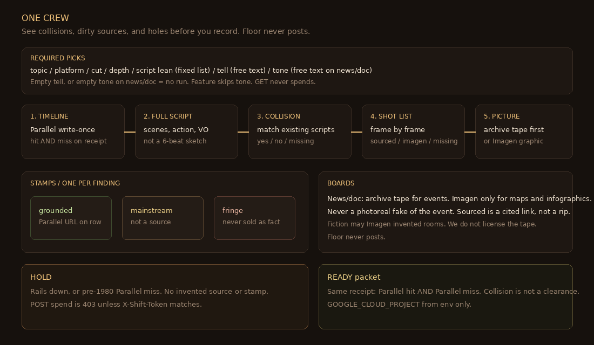

# One Crew

One Crew is a research companion for a one-person shop. Before you record, you see collisions, dirty sources, and holes:

1. a full recordable script with citations (not a 6-beat sketch)
2. which lines already exist as someone else's media (`collision` yes / no / missing)
3. which sources are house organs, propaganda, fringe, or unsourced
4. a frame-by-frame shot list, and what the thesis left out

You leave with a citable thesis plus a script, not a sketch. The research pack is always written: long-form prose plus bibliography, not a stamp list. The thesis lists what was left out and why. We do not post it. We do not clear copyright. We do not give legal advice. We do not license tape. A Parallel miss is not permission. `collision=missing` means we did not get a search, not that you are in the clear. The floor never posts.

**Demo runtime is Gemini 3.5 Flash + ADK + Vertex Imagen. License: Apache-2.0.**

## Required picks

Required, in this order, before any Parallel or Imagen spend. No defaults. Any missing pick = no run.

1. **Topic** (free text) — e.g. "Are we near recession?". Empty or whitespace = no run.
2. **Platform** — `tiktok` | `youtube` | `youtube_shorts` | `instagram_reels` | `instagram_stories` | `instagram_feed` | `facebook_reels` | `facebook_feed` | `threads` | `podcast`
3. **Length / cut** — `tiktok-length` | `shorts` | `weekly_update` | `one_time_short_episode` | `full_length_documentary` | `feature_film`
4. **Depth** — `1y` | `2-3y` | `5y` | `decade` | `few_decades` | `pre-1980_pre-internet`
5. **Script lean** (voice only; does not restamp) — `centered_independent` | `left` | `right` | `far_right` | `far_left` | `unhinged_fringe`
6. **Tell** (required free text) — how the piece is told. Empty or whitespace = no run. Examples only, not a closed list and not an enum:
   - Host-only desk read of the last year of US recession prints
   - No guest. No panel. Just the cited prints.
   - Walk USREC, then payrolls, then GDP — host only
   - One family in Bandar Abbas, kitchen radio on
   - Thriller on a tanker crossing Hormuz that might get hit
   - Weekly news desk, host only
   - Historical drama through one port family
   - Leftover tell (not first-open): Narrator-led global overview of the US and Iran

Pairing is the **cut**, not a parse of tell. `full_length_documentary` and `weekly_update` are always nonfiction: host/reporter VO from the receipt, no invented characters, even if tell says "family thriller". `feature_film` is always fiction: may invent a frame labeled `(frame)` from whatever they typed. Shorts / tiktok / `one_time_short_episode`: news tell → no invented people; story tell → invent frame. Do not 400 because tell contains "thriller". On news/doc, subjects come from the receipt — do not invent a mother in Bandar Abbas if Parallel did not name her.

7. **Tone** (required free text unless `feature_film`) — host stance on news/doc. Empty tone on those cuts = no run. Examples only, not a closed list:
   - News desk
   - Make the viewer think
   - Question the decisions
   - Personal take
   - On the cited print

Tone is not `script_lean` and does not restamp sources. A questioning tone still cannot invent a source or hide fringe. Do not name an example "grounded in reality". `feature_film` does not require tone.

Then a write-once timeline (grounded / mainstream / fringe, house-organ, propaganda, causal links only when Parallel sourced them). Then a **full script you can record from** — scene headings, action/B-roll, host VO or screenplay dialogue — not one block per receipt row. Political `script_lean` changes the spoken argument, not the stamps and not the thickness. Then the collision search on factual VO lines. Then a **frame-by-frame shot list** (shot number, duration, camera, action, line). Each shot is `sourced` | `imagen` | `missing`. Nonfiction uses archive tape for event shots; genAI is for maps and infographics. Never a photoreal fake of a real event. Fiction features may Imagen invented rooms. Sourced is a cited link, not a rip. We do not license the tape we point at and we do not clear rights. Parallel down leaves footage `missing` (no invented URL, no Imagen pretend-source). Lean does not restamp sources or collisions. If the receipt is thin, the script names the hole. It does not invent history to fill pages.

Sample first-open: **oc-recession-july-2026** (youtube · one_time_short_episode · 1y · centered_independent · tell "Host-only desk read of the last year of US recession prints" · tone "On the cited print"). First paint: USREC=0 smashed into payrolls −23k. Seed collisions stay `missing` — GET never spends. Leftover Hormuz (`oc-hormuz-decade`) is a named exclusion/negative case, not first-open.



## How it works

1. First-open shows the required picks, the recession 8-beat VO (USREC=0 smashed into payrolls −23k), source stamps, collision fields (`missing` until a live search), and the shot list. GET never calls Parallel or Imagen.
2. `POST /api/shifts` needs `SHIFT_TOKEN` + `X-Shift-Token` and the required picks. Unset token → 403. Any missing pick (including empty tell, or empty tone on news/doc) → 400. No spend.
3. **Google ADK** crew on **Vertex Gemini 3.5 Flash**: picks → Parallel stack → full script → collision search → shot list → archive tape or Imagen graphic.
4. **Parallel stack:** Search (first pass: first-trigger / recent-news timeline, collision VO, archive footage — this satisfies the Search track) + Extract (quotes / ownership / propaganda / independence from Search URLs) + Task (`pro`, not ultra) for the thesis spine (`result.output.basis`). Parallel does not decide depth and does not write the timed VO. Default horizon is the first event that actually triggered the topic, scoped to recent news; `deeper_history=true` (floor checkbox) is the only user override. The floor depth pick is not forwarded to Task as `inside depth=…`. Vertex writes the script from the pack + picks. A discussant room then votes ship or recut (`not_enough_information` | `other`). Recut for missing cites runs at most one extra Parallel loop, then Vertex rewrites. Search is required at runtime. Extract and Task are why the pack is a thesis. Entity Search only for a verified producer/lobby list. Do not create Monitors (standing watch; burns money; floor never posts).
5. Parallel down, or a pre-1980 miss → fail-closed HOLD. Collision rail down → every collision field `missing`, never `collision=no`. Unhinged lean still cannot invent a source. Gemini does not invent extract text or Task citations.
6. The floor has no publish control. Nothing is posted.

## How to run locally

Python 3.11+. No secrets. Locally Parallel / Vertex / Imagen are missing. First-open still shows the seeded packet. That is the demo.

```bash
cp .env.example .env

python3 -m venv .venv
source .venv/bin/activate
pip install -r backend/requirements.txt

# API + floor on :43158
PYTHONPATH=backend python -m onecrew
```

Open [http://127.0.0.1:43158](http://127.0.0.1:43158). Read the timed recession 8-beat VO, the collision list, and the cited sources. The floor has no publish button.

```bash
PYTHONPATH=backend python -m onecrew &
curl -s http://127.0.0.1:43158/api/health
curl -s http://127.0.0.1:43158/api/packets | python -m json.tool | head

# Live spend — off unless SHIFT_TOKEN is set
# export SHIFT_TOKEN=your-shared-secret
# curl -s -X POST http://127.0.0.1:43158/api/shifts \
#   -H 'content-type: application/json' \
#   -H "X-Shift-Token: $SHIFT_TOKEN" \
#   -d '{"topic":"Are we near recession?","platform":"youtube","cut":"one_time_short_episode","depth":"2-3y","script_lean":"centered_independent","tell":"Host-only desk read of the last year of US recession prints","tone":"On the cited print"}'
```

### Tests

```bash
source .venv/bin/activate
PYTHONPATH=backend pytest backend/tests -q
```

Locks: required picks or no run; empty tell is 400; empty tone on news/doc is 400; documentary cut never invents a family even if tell says drama; fiction frame stays labeled; lean and tone do not restamp sources or collision URLs; Parallel down leaves collision `missing` (never `no`); a leftover Hormuz doc URL hit stamps `collision=yes` on that leftover beat; nonfiction event shots are archive or missing (Imagen is maps/infographics only); GET never spends; POST without token is 403; floor never posts.

### ADK web (optional)

```bash
cd backend
adk web --port 43159
```

### Docker

```bash
docker compose up --build
```

Serves the floor on `43158`.

## Deploy to Cloud Run

Vertex + ADC. Export `YOUR_GCP_PROJECT`. Do not bake keys or a project id into the image.

```bash
export PROJECT_ID=YOUR_GCP_PROJECT
export REGION=us-central1

gcloud config set project $PROJECT_ID
gcloud services enable run.googleapis.com aiplatform.googleapis.com

gcloud run deploy onecrew \
  --source . \
  --region $REGION \
  --allow-unauthenticated \
  --timeout 3600 \
  --min-instances 1 \
  --max-instances 2 \
  --set-secrets "SHIFT_TOKEN=SHIFT_TOKEN:latest,PARALLEL_API_KEY=PARALLEL_API_KEY:latest" \
  --set-env-vars "GOOGLE_CLOUD_PROJECT=$PROJECT_ID,GOOGLE_CLOUD_LOCATION=$REGION,GEMINI_MODEL=gemini-3.5-flash,GOOGLE_GENAI_USE_VERTEXAI=true"
```

Memory store is enough at `--min-instances 1`. Do not require Firestore. `SHIFT_TOKEN` and `PARALLEL_API_KEY` stay secrets. The floor never posts. Do not add an unauthenticated control that bills Parallel or Imagen.

`GOOGLE_CLOUD_PROJECT` comes from the environment only.

## Environment variables

| Variable | Purpose |
|---|---|
| `GOOGLE_GENAI_USE_VERTEXAI` | Default `true`. Vertex is the model rail. |
| `GOOGLE_CLOUD_PROJECT` | Operator export only. Empty if unset. |
| `GOOGLE_CLOUD_LOCATION` | Vertex / Cloud Run region |
| `GOOGLE_APPLICATION_CREDENTIALS` | ADC JSON locally; Cloud Run uses the runtime SA |
| `GEMINI_MODEL` | Default `gemini-3.5-flash` |
| `PARALLEL_API_KEY` | Official Parallel SDK. Empty → Parallel rail down. |
| `SHIFT_TOKEN` | Unset → live spend disabled (403). Set → require header `X-Shift-Token`. |

## Repository map

```
sample_data/packet.json    first-open oc-recession-july-2026
sample_data/frames/        storyboard frames cut from the seed script
backend/onecrew/           FastAPI + ADK crew + receipt lock
backend/tests/             locks
docs/architecture.png        diagram for GitHub (svg is the source)
docs/architecture.svg
DEMO.md
LICENSE
```

## What this is not

Not a publisher. Not a clearance desk. Not legal advice. The floor does not post.
